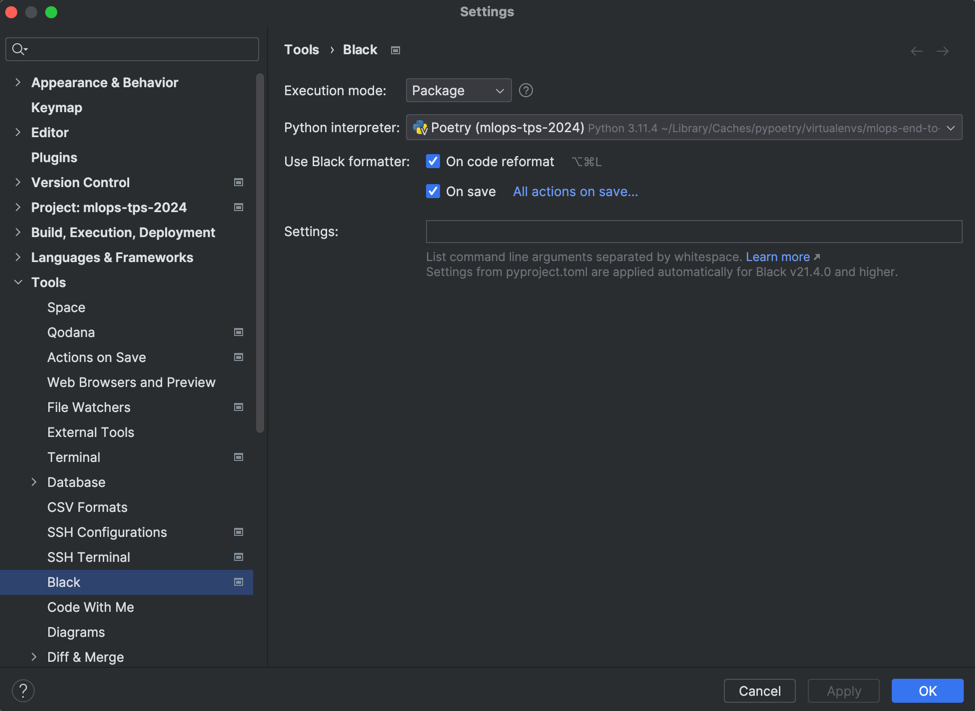

# mlops-tps-2024 💪

Welcome to the 2024 MLOps course repository at TPS. This project aims to teach you how to implement:

- A comprehensive end-to-end MLOps pipeline. 
- Data lake management using MinIO.
- Pipeline orchestration with ZenML.
- Experiment tracking with MLFlow.
- Model deployment using Hugging Face.

Please feel free to ask questions, as this project involves numerous skills that can sometimes be challenging to master.

## 1. Installation ⚙️
### A. Python

For this project, we'll be using Python 3.11:  https://www.linuxcapable.com/how-to-install-python-3-11-on-ubuntu-linux/

### B. Poetry

Install Poetry by following this guide:  https://medium.com/@mronakjain94/comprehensive-guide-to-installing-poetry-on-ubuntu-and-managing-python-projects-949b49ef4f76

Then, activate the Poetry environment:

```bash
#path/to/this/project
poetry install
poetry shell
```

### C. Docker

Install Docker: https://docs.docker.com/engine/install/ubuntu/

### D. Install your IDE

We highly recommend using PyCharm (Community or Professional Edition) for this course: https://www.jetbrains.com/fr-fr/pycharm/download/other.html

### E. Enable black

In PyCharm settings, navigate to Black and enable the code formatter on code reformat and on save as shown below:



### F. Create your accounts

If you haven't already, create your accounts at:

- Discord: https://discord.com/register
- GitHub: https://github.com/join

## 2. Start the stack 🚀

Now, let's start the local stack. First, we need to create the `mlflow` schema for MLflow to register our metadata store.

```bash
#path/to/this/project

# Start the mysql container
docker-compose up mysql-db

# Connect to it
docker exec -ti mlops-tps-2024-mysql-db-1 /bin/bash
mysql -u root -p <mysql-root-password>

# Create the mlflow database
create database mlflow;

# Finally, exit mysql
exit

# And the container
exit
```

Then, go to `src/config` cand copy-paste the `.env.dist` file, rename it `.env`. You can then fill all the `<fill-here>` tokens appropriatly.

You can now run the complete stack:

```bash
#path/to/this/project
docker-compose up

# Setup your ZenML stack
sh stack/setup-local-stack.sh
```

Don't forget to create an `mlflow` bucket on MinIO.

## 3. Quick-access URLs ⚡

- Access ZenML Dashboard: http://localhost:8080/
- Access MinIO S3 bucket: http://localhost:9000/
- Access MLFlow Dashboard: http://localhost:5001/

## 4. Additional materials 📖

Various tools are used to construct this pipeline. Here are some resources for further reading:

- ZenML: https://docs.zenml.io/getting-started/introduction (watch out, use the up-to-date documentation)
- MLFlow documentation: https://mlflow.org/docs/latest/index.html
- For any questions, feel free to reach out to me on Discord or via email at [contact@alexis-schutzger.com](mailto:contact@alexis-schutzger.com).
