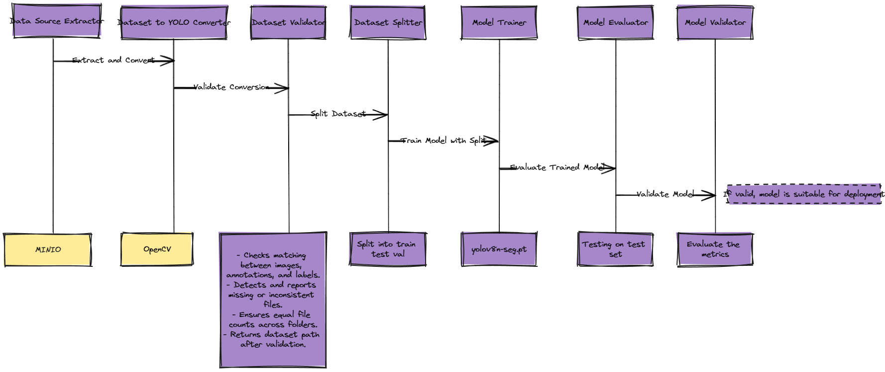

# Rapport de Projet MLOps : Segmentation d'Objets avec YOLO 

## Introduction

Dans le cadre de notre projet MLOps, notre équipe s'est concentrée sur le développement d'un système de segmentation d'objets, en utilisant le modèle YOLO (You Only Look Once). L'objectif principal était de créer un pipeline end-to-end automatisé pour faciliter l'entraînement, l'évaluation et le déploiement du modèle sur un dataset spécifique. Ce rapport présente notre dataset, les outils utilisés, notre pipeline MLOps, les difficultés rencontrées et les solutions apportées.

## Présentation du Dataset

### Description du Dataset
Notre projet utilise le "Human Parsing Dataset", disponible sur la plateforme Hugging Face à l'adresse suivante : [Human Parsing Dataset sur Hugging Face](https://huggingface.co/datasets/mattmdjaga/human_parsing_dataset). Ce dataset est spécifiquement conçu pour les tâches de parsing humain, ce qui implique la segmentation sémantique des images pour identifier et classer différentes parties du corps humain et les vêtements.

### Composition du Dataset
Le dataset est composé d'images avec des annotations précises, couvrant une large variété de poses, d'actions, et de contextes environnementaux. Chaque image est accompagnée de métadonnées détaillées, incluant des masques de segmentation pour différentes catégories telles que les bras, les jambes, les vêtements, etc. Ces annotations détaillées sont essentielles pour entraîner notre modèle de détection d'objets avec précision.

Ce dataset comprend 17 706 paires d'images et de masques. Il s'agit simplement d'une copie du dataset Deep Human Parsing ATR. Les étiquettes des masques sont définies comme suit :
- "0" : "Arrière-plan"
- "1" : "Chapeau"
- "2" : "Cheveux"
- "3" : "Lunettes de soleil"
- "4" : "Vêtements supérieurs"
- "5" : "Jupe"
- "6" : "Pantalon"
- "7" : "Robe"
- "8" : "Ceinture"
- "9" : "Chaussure gauche"
- "10" : "Chaussure droite"
- "11" : "Visage"
- "12" : "Jambe gauche"
- "13" : "Jambe droite"
- "14" : "Bras gauche"
- "15" : "Bras droit"
- "16" : "Sac"
- "17" : "Écharpe"

Voici un exemple d'image du dataset, accompagnée de son masque de segmentation :  

  
   

## Présentation des Outils Utilisés dans le Pipeline MLOps

Notre pipeline MLOps intègre une suite d'outils et de technologies essentiels pour optimiser le cycle de vie du développement des modèles de machine learning. Chaque outil joue un rôle crucial dans l'automatisation et l'efficacité du pipeline, de la gestion des données à l'évaluation des modèles.

### 1. **ZenML**

- **Usage**: Orchestration du pipeline, gestion des workflows de machine learning, et suivi des expériences.
- **Rôle dans le pipeline**: ZenML sert de colonne vertébrale à notre pipeline MLOps, facilitant la définition, l'exécution, et le suivi des différentes étapes du projet.

### 2. **MinIO**

- **Usage**: Stockage d'objets compatible S3 pour la gestion des datasets et des modèles.
- **Rôle dans le pipeline**: Utilisé pour stocker de manière sécurisée les données d'entraînement, les datasets préparés, et les modèles entraînés, grâce à sa compatibilité avec l'écosystème S3.

### 3. **Docker**

- **Usage**: Conteneurisation des applications pour garantir la cohérence des environnements d'exécution.
- **Rôle dans le pipeline**: Docker est utilisé pour encapsuler les environnements de développement et d'exécution, assurant ainsi que le pipeline MLOps fonctionne de manière identique sur tous les systèmes.

### 4. **MLflow**

- **Usage**: Suivi des expériences, gestion du cycle de vie des modèles, et orchestration des déploiements.
- **Rôle dans le pipeline**: MLflow permet de suivre les performances des modèles, les paramètres d'entraînement, et les métriques, facilitant l'analyse et la comparaison des différentes expérimentations.

### 5. **Poetry**

- **Usage**: Gestion des dépendances et packaging des applications Python.
- **Rôle dans le pipeline**: Poetry simplifie la gestion des dépendances et la construction de l'environnement nécessaire au projet, garantissant la reproductibilité des résultats.

## Diagramme de Workflow du Pipeline MLOps 

Le diagramme ci-dessous illustre le workflow complet de notre pipeline MLOps, depuis la gestion des données jusqu'au déploiement du modèle. Chaque étape est orchestrée par ZenML, qui facilite la gestion des workflows de machine learning et le suivi des expériences.

## Les Difficultés Rencontrées et Leurs Solutions

Durant le développement de notre projet MLOps axé sur la segmentation d'objets, nous avons rencontré plusieurs défis qui ont nécessité des solutions créatives et techniques. Voici comment nous avons abordé ces problèmes :

### Transformation des Masques en Fichiers Texte pour YOLO

**Défi** : Notre projet, se distinguant des autres groupes par son focus sur la segmentation plutôt que sur la simple détection d'objets, nécessitait de travailler avec des masques d'image au lieu de boîtes englobantes. Cela posait un problème, car le format YOLO, principalement conçu pour la détection, n'est pas directement compatible avec des masques en nuances de gris qui représentent différentes classes.

**Solution** : Nous avons développé une fonction spécifique pour convertir ces masques en fichiers texte compatibles avec YOLO. Cette fonction identifie les contours de chaque classe dans les masques en nuances de gris et les convertit en polygones. Ces polygones sont ensuite transformés en coordonnées normalisées, s'adaptant ainsi au format d'entrée requis par YOLO. Cela a permis au modèle de comprendre et d'apprendre à partir des données de segmentation.

### Problèmes de RAM Sous WSL

**Défi** : Un des obstacles majeurs rencontrés a été la limitation de la RAM lors de l'exécution du modèle. Notre projet a été développé en utilisant le sous-système Windows pour Linux (WSL), qui offre certes une grande flexibilité pour le développement sous Windows, mais peut parfois être limité en termes de ressources système disponibles, en particulier la mémoire RAM.

**Solution** : Nous avons essayé de diminuer la taille du dataset mais cela n'a pas changé grand chose. Nous avons quand même implémenté le code pour que le programme puisse tourner sur des machines qui ont une RAM plus grande.

## Conclusion

Notre projet MLOps a été une expérience enrichissante, nous permettant de mettre en pratique les concepts et les outils appris tout au long du cours. Nous avons réussi à développer une pipeline MLOps complète pour la segmentation d'objets, en utilisant le modèle YOLO, et à surmonter les défis techniques rencontrés. Ce projet nous a permis de mieux comprendre les enjeux de l'automatisation des workflows de machine learning, et de développer des compétences pratiques en matière de gestion des données, de suivi des expériences, et de déploiement de modèles. Nous sommes fiers du résultat final et des compétences acquises, et nous sommes impatients de poursuivre notre apprentissage dans le domaine du MLOps.
